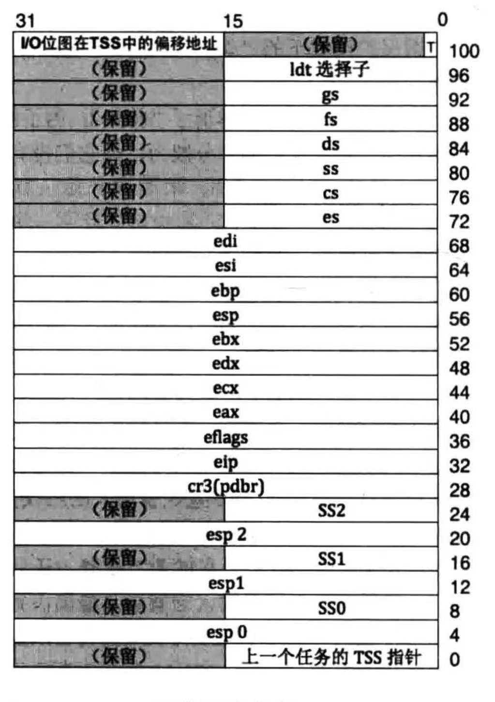

# 中断

## TSS（任务状态段）

​																													tss格式



### tss数据结构

```c
struct tss{
	uint32_t before_tss;
	uint32_t esp0;
	uint32_t ss0;
	uint32_t esp1;
	uint32_t ss1;
	uint32_t esp2;
	uint32_t ss2;
	uint32_t cr3;
	uint32_t eip;
	uint32_t eflags;
	uint32_t eax;
	uint32_t ecx;
	uint32_t edx;
	uint32_t ebx;
	uint32_t esp;
	uint32_t ebp;
	uint32_t esi;
	uint32_t edi;
	uint32_t es;
	uint32_t cs;
	uint32_t ss;
	uint32_t ds;
	uint32_t fs;
	uint32_t gs;
	uint32_t ldt;
	uint16_t blank_space;
	uint16_t io_offset;
};
```

由于效率问题只使用esp0和ss0。

### tss描述符


TR寄存器中存储tss描述符的选择子

### 初始化TSS

```c
void initTss()
{
	put_str("init tss start\n");
	uint32_t tss_size = sizeof(struct tss);
	memset(&TSS,0,tss_size);
	TSS.ss0 = SELECTOR_K_STACK;
	TSS.io_offset = tss_size;
	uint32_t desc = 0xc0000923; //描述符表起始地址
	*(struct GdtDesc*)desc = makeGdtDesc((uint32_t)&TSS,tss_size-1,TSS_DESC_ATTR_HIGH,TSS_DESC_ATTR_LOW); //创建TSS描述符
	desc+=8;
	*(struct GdtDesc*)desc = makeGdtDesc(0,0xfffff,GDT_ATTR_HIGH,GDT_CODE_ATTR_LOW_DPL3);  //创建用户代码段描述符
	desc+=8;
	*(struct GdtDesc*)desc = makeGdtDesc(0,0xfffff,GDT_ATTR_HIGH,GDT_DATA_ATTR_LOW_DPL3);  //创建用户数据段描述符
	uint64_t gdt_operand = ((8*7-1)|((uint64_t)0xc0000903)<<16);
	asm volatile ("lgdt %0"::"m"(gdt_operand)); 	//重新加载gdt地址到gdtr
	asm volatile ("ltr %w0"::"r"(SELECTOR_TSS));	//加载tss选择子到tr寄存器
	put_str("init tss done\n");
}
```


## 中断门描述符

​																									中断门描述符格式

### 中断门数据结构

```c
struct GateDesc{
	uint16_t func_offset_low; //中断函数地址低16位
	uint16_t selector; 		  //中断代码段选择子
	uint8_t dcount;           //描述符固定值
	uint8_t attribute;        //描述符属性
	uint16_t func_offset_high;//中断函数地址高16位
};
```

### 初始化中断

```c
static GateDesc idt[IDT_DESC_CNT]; //中断门描述符表
/*对外接口，初始化IDT*/
void idt_init(void)
{
	put_str("idt init start\n");
	idtDescInit();		//初始化IDT表 
	picInit();			//初始化8259A中断控制芯片
	exceptionInit();	//注册中断函数
	uint64_t idt_operand = ((uint64_t)(uint32_t)idt)<<16 | (sizeof(idt)-1);
	asm volatile ("lidt %0;":"+m"(idt_operand)); //加载中断描述符表到idtr
	put_str("idt init done\n");
}
```


#### 初始化中断描述符表

```c
extern int_handler int_entry_table[IDT_DESC_CNT]; //kernel.s中定义
/*初始化中断描述符表*/
static void idtDescInit(void)
{
	int i;
	for( i = 0;i<0x30;i++){
		mapIdtDesc(idt+i,IDT_DESC_ATTR_DPL0,int_entry_table[i]); //创建前48个中断函数
	}
	memset(idt+0x30,0,sizeof(GateDesc)*0x50);		//清空0x30号中断门至0x7f中断门
	mapIdtDesc(idt+0x80,IDT_DESC_ATTR_DPL3,&syscall_entry); //初始化系统调用中断的中断门描述符
}

/* 初始化中断描述符 */
static void mapIdtDesc(GateDesc*idte,uint8_t attribute,int_handler function)
{
	idte->func_offset_low = ((uint32_t)function&0x0000ffff);
	idte->selector = SELECTOR_K_CODE;
	idte->dcount=0;
	idte->attribute = attribute;
	idte->func_offset_high=((((uint32_t)function&0xffff0000))>>16);
}
```


#### 初始化中断控制芯片8259A

```c
//8259A芯片属性
#define ICW1_IC4 1  //需设置ICW4
#define ICW1_SNGL 0 //级联
#define ICW1_ADI 0  //x86
#define ICW1_LTIM 0 //触发方式:边沿触发
#define ICW1_MASTER ((0b0001<<4) + (ICW1_LTIM<<3) + (ICW1_ADI<<2) + (ICW1_SNGL<<1) + ICW1_IC4)
#define ICW1_SLAVE  ((0b0001<<4) + (ICW1_LTIM<<3) + (ICW1_ADI<<2) + (ICW1_SNGL<<1) + ICW1_IC4)

#define ICW2_MASTER 0x20 //主片起始中断号
#define ICW2_SLAVE  0x28 //从片起始中断号

#define ICW3_MASTER 0b00000100 //IRQ2连接从片
#define ICW3_SLAVE  0x02       //主片IRQ2来连接从片

#define ICW4_SFNM 0
#define ICW4_BUF  0
#define ICW4_MS   0
#define ICW4_AEOI 0
#define ICW4_PM_x86 1
#define ICW4_MASTER ((0b000<<5)+(ICW4_SFNM<<4)+(ICW4_BUF<<3)+(ICW4_MS<<2)+(ICW4_AEOI<<1)+(ICW4_PM_x86))
#define ICW4_SLAVE  ((0b000<<5)+(ICW4_SFNM<<4)+(ICW4_BUF<<3)+(ICW4_MS<<2)+(ICW4_AEOI<<1)+(ICW4_PM_x86))
/*初始化8259A中断芯片*/
static void picInit(void)
{
	/* init master chip */
	outb(PIC_M_CTRL,ICW1_MASTER); //ICW1
	outb(PIC_M_DATA,ICW2_MASTER); //ICW2 start interrupt vector number , the low 3 bit is 0b000
	outb(PIC_M_DATA,ICW3_MASTER); //ICW3 IRQ2 connect to slave
	outb(PIC_M_DATA,ICW4_MASTER); //ICW4 not buf not auto end of interrupt
	/* init slave chip */
	outb(PIC_S_CTRL,ICW1_SLAVE); //ICW1 
	outb(PIC_S_DATA,ICW2_SLAVE); //ICW2
	outb(PIC_S_DATA,ICW3_SLAVE); //ICW3
	outb(PIC_S_DATA,ICW4_SLAVE); //ICW4
	
	outb(PIC_M_DATA,0xf8); // OCW1 开启时钟中断,键盘中断,级联中断
	outb(PIC_S_DATA,0xbf); // OCW1 打开硬盘中断
	put_str("pic init done\n");
}
```


#### 注册中断函数

```c
static void exceptionInit(void)
{
	int i = 0;
	for(i = 0;i<IDT_DESC_CNT;i++){
		int_vector_table[i]=&generalIntHandler;
	}
	registerIntFunc(0x20,&int_0x20_handler);
	registerIntFunc(0x21,&int_0x21_handler);
	int_name[0]="#DE divide error";
	int_name[1]="#DB debug exception";
	int_name[2]="#NMI not masked interrupt";
	int_name[3]="#BP breakpoint exception";
	int_name[4]="#OF overflow exception";
	int_name[5]="#BR bound range exceeded exception";
	int_name[6]="#UD invalid opcode exception";
	int_name[7]="#NM Device not available exception";
	int_name[8]="#DF double fault exception";
	int_name[9]="Coprocessor Segment Overrun";
	int_name[10]="#TS invalid TSS exception";
	int_name[11]="#NP segment not present";
	int_name[12]="#SS Stack fault exception";
	int_name[13]="#GP general protection exception";
	int_name[14]="#PF Page-Fault exception";
	//int_name[15]="#DB debug exception"; unuseed
	int_name[16]="#MF x87 FPU floationg-point error";
	int_name[17]="#AC alignment check exception";
	int_name[18]="#MC machine check exception";
	int_name[19]="#XF SIMD floating-point exception";
	int_name[0x20]="clock interrupt\n";
	int_name[0x21]="keyboadr interrupt\n";
	put_str("execptionInit done\n");
}

```


## 中断压栈情况

(1) 处理器根据中断向量号找到对应的中断描述符后，拿 CPL 和中断门描述符中选择子对应的目标 代码段的 DPL 比对，若 CPL 权限比 DPL 低，即数值上 CPL>DPL，这表示要向高特权级转移，需要切换 到高特权级的栈。这也意味着当执行完中断处理程序后，若要正确返回到当前被中断的进程，同样需要将
栈恢复为此时的旧栈。于是处理器先临时保存当前旧栈SS和 ESP 的值，记作 SS_old和 ESP_old，然后在 TSS 中找到同目标代码段 DPL 级别相同的横加载到寄存器 SS 和 ESP 中，记作 SS_new 和 ESP_new，再将 之前临时保存的 SS old 和 ESP old 压入栈备份，以备返回时重新加载到楼段寄存器 SS 和战指针 ESP。由于 SS_old 是 16 位数据， 32 位模式下的战操作数是 32 位，所以将 SS_old 用 0 扩展其 高 16 位 ，成为 32 位数据后入栈 。
(2)在新栈中压入 EFLAGS 寄存器。
(3)由于要切换到目标代码段，对于这种段间转移，要将 cs 和 EIP 保存到 当前枝中备份，记作 CS old 和 EIP_old，以便中断程序执行结束后能恢复到被中断的进程。同样 CS_old是 16位数据， 需要用 0填充 其高 16 位，扩展为 32 位数据后入战 。 当前棋是新栈，还是旧栈，取决于第1步中是否涉及到特权级转移。
(4)某些异常会有错误码，此错误码用于报告异常是在哪个段上发生的，也就是异常发生的位置，所 以错误码中包含选择子等信息， 一会介绍。错误码会紧跟在 EIP 之后入拢，记作 ERROR CODE。

总结

1. 根据中断向量号找到中断门描述符
2. 进行特权级检查，DPL<=CPL
3. 若发生特权级变化则（1）在旧栈保存用户态的ss和esp （2）在TSS中找到相应特权级的ss和esp加载到相应寄存器上 （3）在新栈中压入用户态的ss和esp （4）压入eflags寄存器值 （5）压入用户态的cs和eip  （6）压入错误码