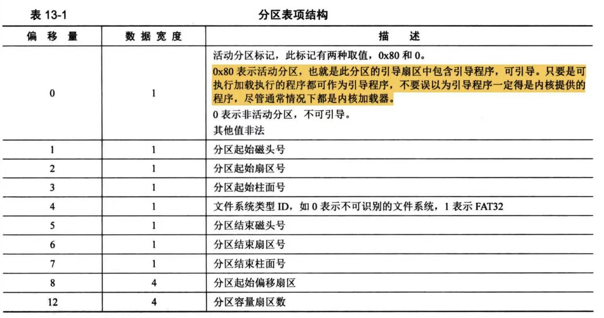
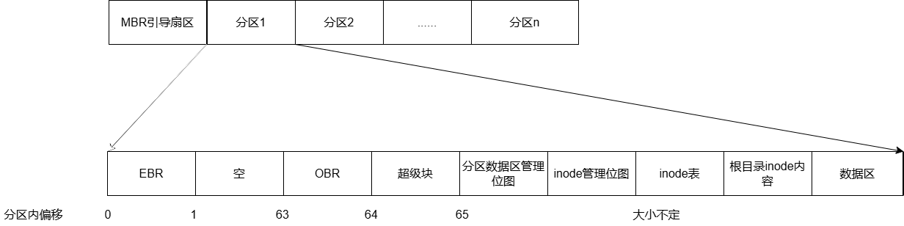
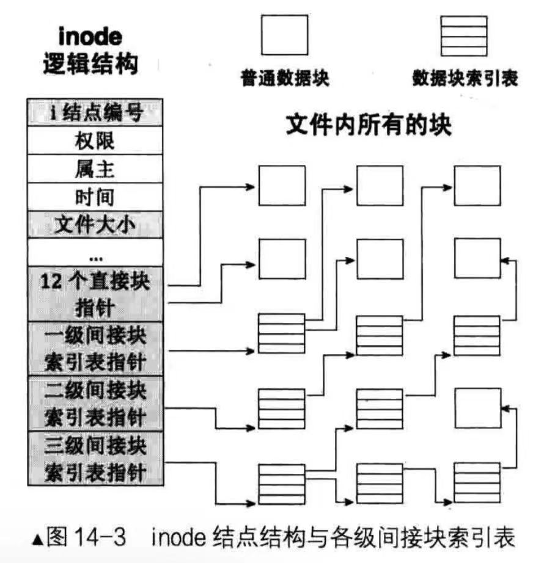

#  文件系统

## 文件系统定义

​	存储，管理，控制，保护计算机系统中持久数据的软件模块。是一种存储在外存的具有某种组织的数据集合。 

## 分区

### 分区优点（原因）

磁盘分区是一种将硬盘分成不同部分的方法，这样可以在同一块硬盘上独立管理不同类型的数据。这样做有以下优点：

1. **操作系统要求**：不同的操作系统可能需要不同的文件系统，例如Windows通常使用NTFS，而Linux可能使用ext4或其他文件系统。通过分区，你可以在同一块硬盘上安装多个操作系统。
2. **组织和管理数据**：分区可以帮助用户更好地组织和管理数据。例如，可以将操作系统安装在一个分区上，将个人文件存储在另一个分区上，这样在重新安装操作系统或升级时，数据更安全。
3. **提高性能**：分区可以提高系统的性能。操作系统运行所在的分区通常会频繁读写，而其他分区如存储文档或媒体文件的分区读写频率较低。这样可以减少磁盘碎片，提高访问速度。
4. **安全性**：分区可以提高数据的安全性。例如，通过设置不同的权限或使用加密，可以保护敏感数据。
5. **备份与恢复**：有了分区，可以更方便地对数据进行备份和恢复。例如，如果系统分区出现问题，你可以重装系统而不影响其他分区的数据。

### 分区表

#### 分区表定义

​	磁盘分区表（DIsk Partition Table) 简称PDT，是由多个分区元信息汇总成的表，表中每一项对应一个分区，主要记录个分区的起始扇区地址，大小界限等。

#### 创建方式

​	由fdisk程序创建，供操作系统使用。

#### 引导扇区类别

​	MBR（主引导记录） ： 位于硬盘最开始扇区，含分区表，其中分区表只有64字节大小，分区表项最多有4个（每个大小为16字节）

​	EBR（拓展引导记录）： 每个子拓展分区都含有EBR，含分区表，表中其中含两项内容：1.对逻辑分区的引导 2.后续分区（EBR）的位置信息。（链式）

​    OBR（操作系统引导记录）： 位于逻辑分区最开始扇区，不含分区表

#### 分区表项



主分区表项中分区起始偏移扇区是该主分区起始地址相对磁盘的偏移，分区容量扇区数是该主分区分区所占扇区数。

拓展分区表项中分区起始偏移扇区是逻辑分区起始地址在本分区的偏移，分区容量扇区数是逻辑分区所占扇区数。

相应数据结构定义如下

```c
/*分区表项*/
struct partition_table_entry{
    uint8_t bootable;        //***可否引导  0x80可引导 0x00不可引导
    uint8_t start_head;      //起始磁头  
    uint8_t start_sect;      //起始扇区
      
    uint8_t fs_type;         //***分区类型  0x05拓展分区
    uint8_t end_head;        //结束磁头  
    uint8_t end_sec;         //结束扇区          靠柱面磁头扇区最多可引导8GB磁盘空间
    uint8_t end_chs;         //结束柱面
    uint32_t start_lba;      //***起始LBA地址       靠LBA最多可引导2TB磁盘空间
    uint32_t sec_cnt;        //***总扇区数目
};
```


## 硬盘逻辑结构

***若为拓展分区则存在EBR，主分区则不存在EBR***



其中逻辑分区是从63开始，分区表项中记录的起始地址是逻辑分区起始地址在本分区的偏移

- 操作系统引导块(OBR):固定在分区中第0个扇区
- 超级块：固定在第1个扇区，描述了空闲块位图，inode位图，inode数组，数据段起始地址等
- 分区数据区管理位图：管理根目录和空闲块区域所占的扇区
- inode管理位图：管理该分区inode编号的使用情况
- inode数组：记录该分区中全部inode信息
- 根目录inode内容：存放根目录inode所指数据项的内容
- 数据区：可读写扇区

## super_block(超级块)

### super_block作用

super_block固定在分区的1号扇区，保存文件系统的元信息。例如：inode表的LBA地址及其扇区数，块位图的LBA地址及其扇区数，inode位图的LBA地址及其扇区数，数据段起始地址等。

### super_block数据结构实现

```c
struct super_block{
    uint32_t magic_number;              //魔数：区分不同的文件系统
    uint32_t sector_cnt;                //分区所占扇区数
    uint32_t inode_cnt;                 //分区inode数
    uint32_t partition_lba_base;        //分区起始地址
    uint32_t block_bitmap_lba;          //块位图起始lba地址
    uint32_t block_bitmap_sector_cnt;   //块位图所占扇区数
    uint32_t inode_bitmap_lba;          //inode位图起始lba地址
    uint32_t inode_bitmap_sector_cnt;   //inode位图所占扇区数
    uint32_t inode_table_lba;           //inode表起始lba地址
    uint32_t inode_table_sector_cnt;    //inode表所占扇区数
    uint32_t data_start_lba;            //数据段起始lba地址
    uint32_t root_inode_index;          //root节点在inode表中的索引
    uint32_t dir_entry_size;            //每个目录表条目大小
    uint32_t inode_size;			   //每个inode大小
};
```


## inode(索引节点)

### inode定义

在Linux文件系统中，inode（索引节点）的定义是一个数据结构，用于存储文件的元数据（除了文件名和文件内容）。每个文件（包括目录，因为在Unix和类Unix系统中，目录也是一种文件）在文件系统中都有一个对应的inode，它包含了文件的所有信息，除了文件名。文件名由目录文件管理，目录文件将文件名映射到inode号。

具体来说，一个inode通常包含以下信息：

- **文件类型**：文件是普通文件、目录、字符设备、块设备等。
- **权限**：文件的访问权限，包括所有者、所属组以及其他用户的读、写和执行权限。
- **所有者**：文件的所有者的用户ID（UID）。
- **组**：文件的组所有者的组ID（GID）。
- **大小**：文件的大小（字节为单位）。
- **时间戳**：文件的创建时间、最后访问时间、最后修改时间等。
- **链接计数**：指向文件的硬链接数。当计数为0时，文件被删除。
- **数据块指针**：指向存储文件数据的块的指针。这包括直接指针、间接指针、二级间接指针和三级间接指针，它们指向实际存储文件数据的磁盘块。

inode的设计使得文件系统可以快速访问文件的元数据和数据块，从而提高效率。同时，inode使得文件名和文件数据分离，增加了文件系统的灵活性和管理效率。


### inode逻辑结构




### inode数据结构实现

```c
/* 将来会被写入硬盘中 inode表 ， inode表项*/
struct inode{
    uint32_t i_index;               //在inode表中的索引
    uint32_t i_size;                //inode是文件时，i_size为文件大小 ， inode是指该目录下所有目录项大小之和
    uint32_t i_open_cnt;            //文件被打开次数
    uint32_t i_sectors[15];         //12个直接数据块地址，1个1级间接块地址,1个2级间接块地址，1个3级间接块地址
    enum file_type file_type;	    //文件类型
    uint32_t hard_link_cnt; 	    //硬链接数
    enum privilege mode;	    	//权限
    
    bool write_denyl;               //防止进程同时写入
    struct list_elem inode_node;    //内存中需链接起相应inode
};
```


inode类型为目录时数据中的数据项为dir_entry

```c
/* 目录的inode指向的数据段的目录条目 */
struct dir_entry{
    char name[MAX_FILE_NAME_LEN]; 	//文件名
    uint32_t i_index;  				//文件的inode索引
    enum file_types  f_type;		//文件类型
};
```

## 为指定分区创建文件系统

​	创建文件系统就是创建文件系统所需要的元信息，这包括超级块位置及大小，空闲块位图的位置及大小，inode位图及大小，空闲块起始地址，根目录起始地址。

### 创建过程

1. 根据分区part大小，计算分区文件系统各**元信息**所需的**扇区数及位置**。
2. 在**内存**中创建超级块，将计算得到的信息写入内存。
3. 将**超级块**写入**磁盘**。
4. 将**元信息**写入**磁盘**上各自位置。
5. 将**根目录内容**写入**磁盘**。  

### 代码实现

```c
/*创建文件系统*/
static void format_partition(struct partition*part) 
{
/* ******************************
 * 1.计算元信息
 * ******************************/
    uint32_t part_start_lba = part->start_lba;
    uint32_t part_sect_cnt = part->sector_cnt;
    uint32_t boot_sector_cnt = 1 , super_block_sector_cnt = 1;
    uint32_t inode_bitmap_sector_cnt = DIV_ROUND_UP(MAX_INODE_PER_PARTS , 8 * SECTOR_SIZE);
    uint32_t inode_table_sector_cnt = DIV_ROUND_UP(MAX_INODE_PER_PARTS * sizeof(struct inode) , SECTOR_SIZE);
    uint32_t free_sector_cnt = part->sector_cnt - boot_sector_cnt - super_block_sector_cnt - inode_bitmap_sector_cnt - inode_table_sector_cnt;
    uint32_t block_bitmap_sector_cnt = DIV_ROUND_UP(free_sector_cnt,SECTOR_SIZE*8+1);
    uint32_t data_block_sector_cnt = free_sector_cnt - block_bitmap_sector_cnt;

/* ******************************
 * 2.在内存中创建超级块并填充元信息
 * ******************************/
    struct super_block sb;
    sb.magic_number = 0x20040104;
    sb.sector_cnt = part_sect_cnt;
    sb.inode_cnt = MAX_INODE_PER_PARTS;
    sb.partition_lba_base = part_start_lba;
    sb.block_bitmap_lba = part->start_lba + boot_sector_cnt + super_block_sector_cnt;
    sb.block_bitmap_sector_cnt = block_bitmap_sector_cnt;
    sb.inode_bitmap_lba =  part->start_lba + boot_sector_cnt + super_block_sector_cnt + block_bitmap_sector_cnt;
    sb.inode_bitmap_sector_cnt = inode_bitmap_sector_cnt;
    sb.inode_table_lba = part->start_lba + boot_sector_cnt + super_block_sector_cnt + block_bitmap_sector_cnt + inode_bitmap_sector_cnt;
    sb.inode_table_sector_cnt = inode_table_sector_cnt;
    sb.data_start_lba = part->start_lba + boot_sector_cnt + super_block_sector_cnt + block_bitmap_sector_cnt + inode_bitmap_sector_cnt + inode_table_sector_cnt;
    sb.root_inode_index = 0;
    sb.dir_entry_size =  sizeof(struct dir_entry);
    sb.inode_size = sizeof(struct inode);

/* ******************************
 * 3.将超级块写入磁盘
 * ******************************/
    writeDisk(&sb,part->my_disk,part->start_lba+1,1);
    /*创建元数据缓冲区*/
    uint32_t buf_size = ((sb.block_bitmap_sector_cnt>sb.inode_bitmap_sector_cnt?(sb.block_bitmap_sector_cnt>sb.inode_table_sector_cnt?sb.block_bitmap_sector_cnt:sb.inode_table_sector_cnt):sb.inode_bitmap_sector_cnt))*SECTOR_SIZE;
    char* buf = (char*)sys_malloc(buf_size);
    ASSERT(buf!=NULL);

    struct Bitmap bitmap;
    bitmap.pbitmap = (uint8_t*)buf;
    bitmap.bitmap_byte_len = buf_size;
    initBitmap(&bitmap);
/* ******************************
 * 4.将数据块位图写入磁盘
 * ******************************/
    setBitmap(&bitmap,0,1); //根目录数据块占1扇区，所以将位图第0位置0
    /*将块位图中不存在的位置1*/
    uint32_t odd_bit_index = block_bitmap_sector_cnt*4096 - data_block_sector_cnt - 1; 
    uint32_t edge = block_bitmap_sector_cnt * 4096;
    for(;odd_bit_index < edge ;odd_bit_index++){
        setBitmap(&bitmap,odd_bit_index,1);
    }
    writeDisk(buf,part->my_disk,sb.block_bitmap_lba,sb.block_bitmap_sector_cnt);
    memset(buf,0,buf_size);

/* ******************************
 * 5.将inode位图写入磁盘
 * ******************************/
    setBitmap(&bitmap,0,1);
    writeDisk(buf,part->my_disk,sb.inode_bitmap_lba,sb.inode_bitmap_sector_cnt);
    memset(buf,0,buf_size);

/* ******************************
 * 6.将跟目录inode数据区写入磁盘
 * ******************************/
    struct inode* inode = (struct inode*) buf;
    inode->i_index=0;
    inode->i_size = sizeof(struct dir_entry)*2;
    inode->i_sectors[0] = sb.data_start_lba;
    writeDisk(buf,part->my_disk,sb.inode_table_lba,1);
    memset(buf,0,buf_size);

/* ******************************
 * 7.将跟目录inode数据区写入磁盘
 * ******************************/
    struct dir_entry*dir_ety =(struct dir_entry*)buf;
    memcpy(dir_ety->name,".",1);
    dir_ety->i_index = 0;
    dir_ety->f_type = FT_DIRECTORY;
    dir_ety++;
    memcpy(dir_ety->name,"..",2);
    dir_ety->i_index = 0;
    dir_ety->f_type = FT_DIRECTORY;

    writeDisk(buf,part->my_disk,sb.data_start_lba,1);
    sys_free((void*)buf);
}  
```
