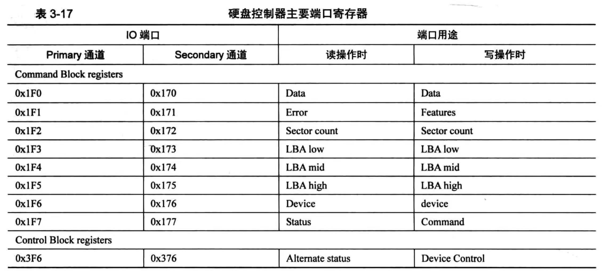

# 磁盘驱动

## 磁盘各端口作用



### 命令块寄存器（Command Block Registers）

1. **Data (数据) 端口 (0x1F0/0x170)**：
   - 用于读取或写入数据。在数据传输指令（如读盘或写盘）期间，数据通过此端口流入流出。
2. **Error (错误) 端口 (0x1F1/0x171)**：
   - 用于读取最后执行命令的错误代码。每个错误代码都对应特定的故障类型。
3. **Features (特征) 端口 (0x1F1/0x171)**：
   - 在发送命令前，通过此端口设置特定的命令特征或选项。
4. **Sector Count (扇区计数) 端口 (0x1F2/0x172)**：
   - 设置或查询一次操作中将处理的扇区数量。
5. **LBA Low (LBA低位) 端口 (0x1F3/0x173)**：
   - 逻辑块地址（LBA）的低8位，用于指定硬盘上数据存储的位置。
6. **LBA Mid (LBA中位) 端口 (0x1F4/0x174)**：
   - LBA地址的中8位。
7. **LBA High (LBA高位) 端口 (0x1F5/0x175)**：
   - LBA地址的高8位。
8. **Device (设备) 端口 (0x1F6/0x176)**：
   - 选择操作的硬盘（主盘或从盘）和操作模式（如LBA模式）。
9. **Status (状态) 端口 (0x1F7/0x177)**：
   - 显示当前设备状态，如是否准备就绪、是否忙碌等。

### 控制块寄存器（Control Block Registers）

1. **Alternate Status (备用状态) 端口 (0x3F6/0x376)**：
   - 功能与主状态端口相同，但读取此寄存器不会清除中断请求（IRQ）。
2. **Device Control (设备控制) 端口 (0x3F6/0x376)**：
   - 用于控制硬盘的基本操作，如软复位和启用/禁用中断请求。

```c
#define reg_data(channel)       (channel->disk_port_base+0) //数据端口 每次传输2字节
#define reg_error(channel)      (channel->disk_port_base+1) //错误信息端口
#define reg_features(channel)   (channel->disk_port_base+1) 
#define reg_sect_cnt(channel)   (channel->disk_port_base+2) //操作扇区数量端口
#define reg_lba_l(channel)      (channel->disk_port_base+3) //LBA低8位端口
#define reg_lba_m(channel)      (channel->disk_port_base+4) //LBA中8位端口
#define reg_lba_h(channel)      (channel->disk_port_base+5) //LBA中高8位端口
#define reg_dev(channel)        (channel->disk_port_base+6) //LBA高4位及设备信息端口
#define reg_status(channel)     (channel->disk_port_base+7) //状态端口
#define reg_command(channel)    (channel->disk_port_base+7) //命令端口
#define reg_alt_status(channel) (channel->disk_port_base+0x206) //备用状态寄存器端口
```

## 设置硬盘寄存器的相关函数

### 选择硬盘设备

```c
/*选择读写的硬盘*/
static void select_disk(struct disk*hd)
{
    outb(reg_dev(hd->my_channel),DEV_MBS_BIT | DEV_LBA_BIT | ((hd->dev_tag==1)?DEV_DEV_BIT:0)); //向dev寄存器发送消息
}
```

### 设置操作硬盘的起始扇区LBA地址和数量

```c
/*选择地址和数量*/
static void select_sector(struct disk*hd,uint32_t lba_addr,uint8_t cnt)
{
    lba_addr&=0x0fffffff;
    struct ide_channel*channel=hd->my_channel;
    ASSERT(channel!=NULL);
    outb(reg_sect_cnt(channel),cnt);                     //选择数量  当cnt为0时，规定操作256个扇区
    outb(reg_lba_l(channel),lba_addr&0x000000ff);        //选择LBA低8位
    outb(reg_lba_m(channel),(lba_addr&0x0000ff00) >> 8); //选择LBA中8位
    outb(reg_lba_h(channel),(lba_addr&0x00ff0000) >> 16);//选择LBA高8位
    outb(reg_dev(channel),(DEV_MBS_BIT | DEV_LBA_BIT | ((hd->dev_tag)==1?DEV_DEV_BIT:0)|(lba_addr&0x0f000000)>>24));//选择LBA最高4位
}
```

### 设置命令寄存器

```c
/*选择命令*/
static void out_cmd(struct disk* hd,uint8_t cmd)
{
    struct ide_channel* channel = hd->my_channel;
    channel->expecting_int = true;  //期待中断位设置为1
    out b(reg_command(channel),cmd); //向command端口输出命令
}
```

### 从数据寄存器中读取数据

```c
/*从数据寄存器读数据*/
static void read_form_disk(struct disk*hd,void*buf,uint8_t sec_cnt)
{
    uint32_t byte_size = sec_cnt==0?256<<9:sec_cnt<<9;
    insw(reg_data(hd->my_channel),buf,byte_size/2);    
}
```

### 向数据寄存器中写入数据

```c
/*向数据寄存器写数据*/
static void write2disk(struct disk*hd,void*buf,uint8_t sec_cnt)
{
    uint32_t byte_size = sec_cnt==0?256<<9:sec_cnt<<9;
    outsw(reg_data(hd->my_channel),buf,byte_size/2);   
}
```

## 操作硬盘API

### readDisk(从硬盘读取指定位置与扇区数量的数据到内存)

```c
/*从硬盘中读取数据到buf*/
void readDisk(void*const buf,struct disk* hd,uint32_t lba_addr,uint32_t cnt)
{
    ASSERT(lba_addr<MAX_LBA);
    acquireLock(&hd->my_channel->channel_lock); //获取该通道锁
    select_disk(hd);  //选择硬盘，设置device寄存器
    uint32_t reserve_cnt = cnt%256; //一次操作不足256扇区的部分
    uint32_t edge_cnt = cnt/256;    //操作足够256扇区的数量
    uint32_t i = 0 ;
    for(i=0;i<edge_cnt;i++){
        select_sector(hd,lba_addr,(uint8_t)256); //选择扇区数和起始地址
        out_cmd(hd->my_channel,(uint8_t)CMD_READ_SECTOR);//选择硬盘操作
        
        /**********阻塞等待硬盘中断唤醒********/
        semaDown(&hd->my_channel->disk_working);
        /************************************/

        if(busy_wait(hd)==false){ /* 若硬盘操作出错 */
            char error[64];
            sprintf(error,"%s read sector %d failed!!!!\n",hd->name,lba_addr+i*256);
            PANIC(error);
        }
        read_form_disk(hd,(char*)buf+(i*256*512),(uint8_t)256); //向buf中读取数据
    }
    /*操作不足256扇区的部分*/
    select_sector(hd,lba_addr,reserve_cnt);
    out_cmd(hd->my_channel,CMD_READ_SECTOR);
    semaDown(&hd->my_channel->disk_working);
    if(busy_wait(hd)==false){
        char error[64];
        sprintf(error,"%s read sector %d failed!!!!\n",hd->name,lba_addr+i*256);
        PANIC(error);
    }
    read_form_disk(hd,(char*)buf+(i*256*512),reserve_cnt);

    releaseLock(&hd->my_channel->channel_lock);     //释放通道锁
}
```

### writeDisk(将内存中数据写入硬盘指定位置)

```c
/* 从buf中写入数据到硬盘 */
void writeDisk(const void*const buf,struct disk* hd,uint32_t lba_addr,uint32_t cnt)
{
    ASSERT(lba_addr<MAX_LBA);
    acquireLock(&hd->my_channel->channel_lock); //获取该通道锁
    select_disk(hd);  //选择硬盘，设置device寄存器
    uint32_t reserve_cnt = cnt%256; //一次操作不足256扇区的部分
    uint32_t edge_cnt = cnt/256;    //操作足够256扇区的数量
    uint32_t i = 0 ;
    for(i=0;i<edge_cnt;i++){
        select_sector(hd,lba_addr,(uint8_t)256); //选择扇区数和起始地址
        out_cmd(hd->my_channel,(uint8_t)CMD_WRITE_SECTOR);//选择硬盘操作
        
        /**********阻塞等待硬盘中断唤醒********/
        semaDown(&hd->my_channel->disk_working);
        /************************************/

        if(busy_wait(hd)==false){ /* 若硬盘操作出错 */
            char error[64];
            sprintf(error,"%s read sector %d failed!!!!\n",hd->name,lba_addr+i*256);
            PANIC(error);
        }
        write2disk(hd,(char*)buf+(i*256*512),(uint8_t)256); //向buf中读取数据
    }
    /* 操作不足256扇区的部分 */
    select_sector(hd,lba_addr,reserve_cnt);
    out_cmd(hd->my_channel,CMD_READ_SECTOR);
    semaDown(&hd->my_channel->disk_working);
    if(busy_wait(hd)==false){
        char error[64];
        sprintf(error,"%s read sector %d failed!!!!\n",hd->name,lba_addr+i*256);
        PANIC(error);
    }
    write2disk(hd,(char*)buf+(i*256*512),reserve_cnt);

    releaseLock(&hd->my_channel->channel_lock);     //释放通道锁
}
```

## 磁盘管理

### 数据结构定义

​	硬件是实实在在的东西，想要在软件中管理他们，只能从逻辑上抓住这些硬件的特性，将他们抽象成一些数据结构，然后这些数据结构便代表了硬件，用这些数据结构来组织硬件的信息和状态，在逻辑上硬件就是这些数据结构。

```c
/*分区结构*/
struct partition{
    char name[8];                   //*分区名称
    struct disk*my_disk;            //*分区所属的硬盘
    uint32_t start_lba;             //*分区起始扇区
    uint32_t sector_cnt;            //*扇区数           单个分区最大支持存储 2^32 * 2^9 = 2^41 = 2TB
    struct list_elem part_node;     //*用于队列中的标记
    
    struct super_block*sb;          //*本分区的超级块
    struct Bitmap block_bitmap;     //*块位图 --- 用来表示哪些扇区被使用那些未使用
    struct Bitmap inode_bitmap;     //*i节点位图
    struct list open_inodes;        //*该分区打开的i节点队列
};

/*硬盘结构 */
struct disk{
    char name[8];                   //*硬盘名称
    struct ide_channel* my_channel; //*硬盘所属通道
    uint8_t dev_tag;                //*硬盘是主盘0还是从盘1
    struct partition prim_parts[4]; //*4个主分区
    struct partition logic_parts[8];//*无限多个逻辑分区
};

/*ATA通道结构 主盘和从盘公用一个通道 
 *主盘和从盘共享同一通道的端口基址（port base），但使用不同的寄存器（device寄存器中DEV位）或命令来区分操作是针对主盘还是从盘。
 */
struct ide_channel{
    char name[8];                   //*通道名称
    uint16_t disk_port_base;        //*硬盘操作起始端口号
    struct lock channel_lock;       //*通道锁
    struct semaphore disk_working;  //*用于阻塞，中断程序唤醒继续读或写
    struct disk disks[2];           //*通道上连接俩设备一个主盘一个从盘
    
    uint8_t int_num;                //通道所用中断号
    bool expecting_int;             //标记正在等待硬盘中断
};
```

### 初始化通道

```c
/*初始化通道*/
void initIDE()
{
    put_str("ide_init start\n");
    uint8_t hd_cnt = *((uint8_t*)(0x475)); //获取硬盘数
    channel_cnt = DIV_ROUND_UP(hd_cnt,2);  //硬盘数/2 向上取整位通道数
    struct ide_channel*channel;              
    int i = 0;
    for(i=0;i<channel_cnt;i++){             //初始化两通道
        memset(channel,0,sizeof(struct ide_channel));
        channel = channels + i; 
        sprintf(channel->name,"ide%d",i);
        switch(i){
            case 0:
                channel->disk_port_base = 0x1f0; // 主盘端口
                channel->int_num = 0x2e;         // 主盘中断号
                break;
            case 1:
                channel->disk_port_base = 0x170; // 从盘端口
                channel->int_num = 0x2f;         // 从盘中断号
                break;
        }
        registerIntFunc(channel->int_num,&int_hd_handler);   //注册硬盘中断函数
        initLock(&channel->channel_lock);         //初始化通道锁
        initSema(&channel->disk_working,0);  //信号量初值设置为0
        //初始化channel中的disks
        int dev_no = 0;
        for(;dev_no<2;dev_no++){ 
            struct disk* disk = &channel->disks[dev_no];
            disk->my_channel = channel;
            disk->dev_tag = dev_no;
            sprintf(disk->name,"sd%c",'a'+dev_no);
            identify_disk(disk);
            if(dev_no!=0){ //若为从盘则扫描盘上分区表
                initPartitions(disk);
            }
            primary_index=0,logic_index=0;
        }
    }
    put_str("ide_init done\n");
}
```

### 初始化磁盘分区

```c
/*调整MBR分区表，使最后一项为拓展分区项*/
static void adjustPartitionTable(char* buf)
{
    struct partition_table_entry * ppte = ((struct boot_sector*)buf)->partition_table;
    int i = 0;
    struct partition_table_entry ext_pte;
    for(i = 0;i<4;i++)
    {
        if((ppte+i)->fs_type == 0x05){
            ext_pte = ppte[i];
            int j = 0;
            for(j=i;j<3;j++){
                ppte[j]=ppte[j+1]; //
            }
            ppte[3]=ext_pte;
            break;
        }
    }
}

/* 从磁盘读取分区结构 初始化磁盘分区数据结构 */
static void initPartitions(struct disk* hd)
{
    uint32_t lba_addr = 0;
    uint32_t ext_lba_base = 0; //拓展分区总偏移
    uint32_t ext_lba = 0;     //
    uint32_t primary_index = 0;
    uint32_t logic_index = 0;
    bool first_read_tag = true;
    int i = 0;
    while(1){
        char buf[512];
        bool found_extend = false;
        readDisk(buf,hd,lba_addr,1); 
        if(first_read_tag == true){
            first_read_tag = false ;
            adjustPartitionTable(buf); //调整partitionTable 让最后一项为拓展分区项
        }
        struct partition_table_entry * ppte = ((struct boot_sector*)buf)->partition_table; 
        
        for(;i<4;i++){
            if(ppte->fs_type==0x05)/*拓展分区*/
            {
                lba_addr = ext_lba_base + ext_lba + ppte->start_lba;
                if(ext_lba_base==0){                // 转到总扩展分区
                    ext_lba_base = ppte->start_lba; // 设置ext_lba_base
                }else{
                    ext_lba = ppte->start_lba;     //下一项的总拓展分区内偏移
                }
                found_extend = true;
                break;
            }
            if(ppte->fs_type!=0) /*为有效分区*/
            {
                if(ext_lba_base == 0){ //为主分区
                    sprintf(hd->prim_parts[primary_index].name,"%s%d",hd->name,primary_index+1); //初始化主分区名称
                    hd->prim_parts[primary_index].start_lba = ppte->start_lba;                   //初始化LBA起始地址
                    hd->prim_parts[primary_index].sector_cnt = ppte->sec_cnt;                    //初始化扇区数
                    hd->prim_parts[primary_index].my_disk = hd;                                  //填加硬盘
                    list_append(&partition_list,&hd->prim_parts[primary_index].part_node);       //填加分区节点到分区链表

                    primary_index++;  
                }else{ //为子扩展分区
                    sprintf(hd->logic_parts[logic_index].name,"%s%d",hd->name,logic_index+5);           //初始化子拓展分区
                    hd->logic_parts[logic_index].start_lba = ppte->start_lba/*逻辑分区内偏移*/ + ext_lba_base /*总拓展分区相对磁盘偏移*/ + ext_lba/*逻辑分区相对拓展分区偏移*/;  //初始化LBA起始地址
                    hd->logic_parts[logic_index].sector_cnt = ppte->sec_cnt;                            //初始化扇区数
                    hd->logic_parts[logic_index].my_disk = hd;                                          //添加硬盘
                    list_append(&partition_list,&hd->logic_parts[logic_index].part_node);               //添加分区节点到分区链表

                    logic_index++;
                }
            }
            ppte++;
        }
        if(found_extend == false){ 
            break;
        }
        else {
            i=2;
        }
    }
}
```

